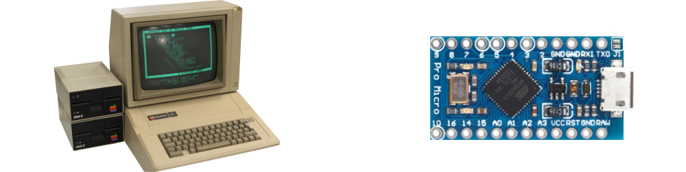

# [Johnny "Ace" Anderson](http://www.people.vcu.edu/~jranderson/)

I grew up learning to code on a variety of classic 8-bit microcomputers, including the venerable Apple II and Commodore 64. Over the ensuing years, however, my interest in programming sadly waned as my available discretionary time inevitably diminished, and the sedimentary layers of abstracted software complexity piled ever and ever higher.

In an effort to rediscover the joys of my early explorations in electronic logic, I turned my attention toward learning the [Arduino](https://github.com/arduino/Arduino) ecosystem of embedded development. Successfully overcoming the severe constraints of confined memory and limited CPU cycles seemed a far more satisfying mental challenge than studying yet another upstart flavor-of-the-month framework.

## Baby's First µController

Rather than start predictably with the ubiquitous but bulky Arduino Uno and its painfully basic IDE, I decided instead to bootstrap my knowledge base by beginning with the slightly more sophisticated [Sparkfun Pro Micro](https://github.com/sparkfun/Pro_Micro) as my introductory µC of study, along with [Visual Studio Code](https://github.com/microsoft/vscode) and [PlatformIO](https://github.com/platformio/platformio-core) as my development environment and build toolchain.

- Sparkfun's **Pro Micro** hosts an `ATmega32U4`, which offers several advantages over the **Uno**'s `ATmega328P`, most notably a built-in USB transceiver and native HID capabilities. This diminutive dev board also shares its common 0.6" pitch DIP form factor with a large selection of varying compact µControllers.

- **VS Code**'s flexible configuration and exceptional editing features put it *streets ahead* of Arduino's primitive IDE, with stellar syntax highlighting, smart code completion, convenient GitHub integration, advanced debugging, and powerful extensions providing support for seemingly every language available.

- **PlatformIO** expertly manages disparate source code repositories and sundry platform build targets while avoiding proprietary dependencies. This toolchain enables the easy reuse of both local and remote code, library management, and common build configurations across a wide array of embedded ecosystems.

All of these tools are open source and are interchangeable with compatible workalikes, making it trivial to experiment with different µC architectures using various development environments on any modern operating system.

## Learning Goals

Since my extant programming skills are passable, I'm able to focus on developing a best-practices library of UI display output routines with integrated events system.

- Interface with buttons, potentiometers, and rotary encoders.
- Emulate HID devices: keyboards, mice, gamepads, and MIDI.
- Illuminate addressable RGB pixels using [FastLED](https://github.com/FastLED/FastLED) library.
- Script with [Bitlash](https://github.com/billroy/bitlash) serial command shell.
- Processing [p5.js](https://github.com/processing/p5.js) via [serialport](https://github.com/p5-serial/p5.serialport) to display µC data in browser.
- Analyze live audio using a mic, FHT algorithm, and `MSGEQ7`.

## Projects

Individual projects are housed in their respective directories. A list of them all should exist somewhere, you would think, if not right here in this very document section.
